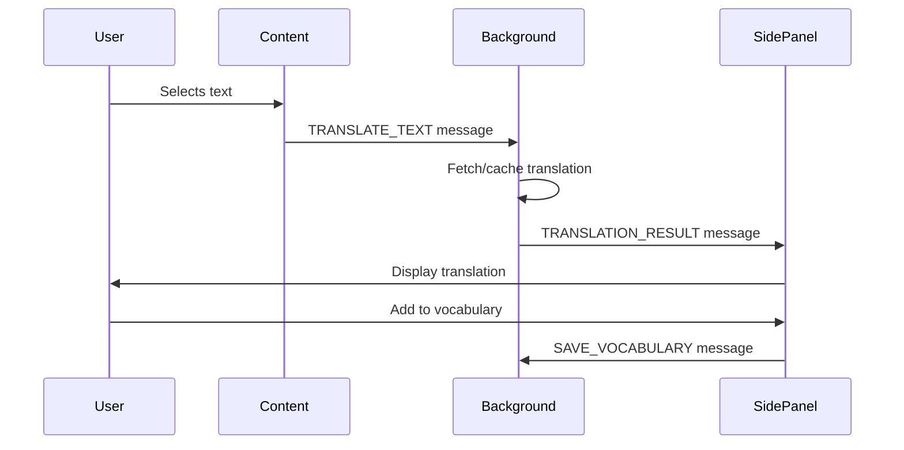

# Side Panel - Translation Drawer UI

## Overview

The side panel provides a beautiful, modern translation interface that appears when users select text on any webpage. It integrates seamlessly with Chrome's native side panel API.

## Features

### 🎯 Core Features

1. **Instant Translation Display**
   - Clean, card-based UI showing original text and translation
   - Supports multiple translation details (phonetics, explanations, examples)
   - Web translations for additional context

2. **Audio Pronunciation**
   - Text-to-Speech using Web Speech API
   - Fallback to Youdao TTS service
   - Visual feedback during playback

3. **Vocabulary Management**
   - One-click "Add to Vocabulary" button
   - Auto-detection of already saved words
   - Visual confirmation when words are saved

4. **User Experience**
   - Empty state with helpful instructions
   - Loading states with spinner
   - Error handling with retry option
   - Copy translation to clipboard
   - Smooth animations and transitions

### 🎨 UI Components

#### Empty State
Shows when no text is selected, with:
- Icon and welcome message
- Usage instructions
- Keyboard shortcut hints

#### Translation View
Main content area showing:
- Original text card with pronunciation button
- Translation card with copy button
- Detailed explanations list
- Example sentences
- Web translations

#### Action Footer
Fixed footer with:
- "Add to Vocabulary" button
- Status indication (saved/unsaved)

## Architecture

```
sidepanel/
├── sidepanel.html       # Entry HTML file
├── index.tsx            # React initialization
├── App.tsx              # Main app container & message handling
├── TranslationView.tsx  # Core translation UI component
├── sidepanel.css        # Custom styles
└── README.md            # This file
```

## Message Flow



## State Management

The App component manages:
- `selectedText`: Currently selected text
- `translation`: Translation result from API
- `isLoading`: Loading state
- `error`: Error message if translation fails

## Styling

- Uses Tailwind CSS for utility classes
- Custom CSS variables for theming (light/dark mode)
- Smooth animations for card appearances
- Custom scrollbar styling
- Responsive design for different side panel widths

## Integration Points

### Chrome APIs Used
- `chrome.runtime.onMessage` - Receive translation results
- `chrome.storage.local` - Persist pending translations

### Internal Dependencies
- `storage/db.ts` - IndexedDB interfaces
- `storage/vocabularyRepository.ts` - Vocabulary CRUD operations
- `utils/messaging.ts` - Type-safe Chrome messaging

## Development

### Adding New Features

1. **Add new card type**: Create a new section in `TranslationView.tsx`
2. **Add new action**: Add button in footer and handler function
3. **Add new message type**: Update `utils/messaging.ts` and handle in `App.tsx`

### Testing

Test scenarios:
- Select single word
- Select phrase/sentence
- Select text with no translation available
- Test audio playback
- Test vocabulary save
- Test clipboard copy
- Test error states
- Test loading states
- Test dark mode

## Future Enhancements

- [ ] Word difficulty level badge (CEFR: A1-C2)
- [ ] Inline tags for vocabulary items
- [ ] History of recent translations
- [ ] Search within side panel
- [ ] Customizable UI settings (font size, colors)
- [ ] Quick actions (search in dictionary, web search)
- [ ] Spaced repetition reminders
